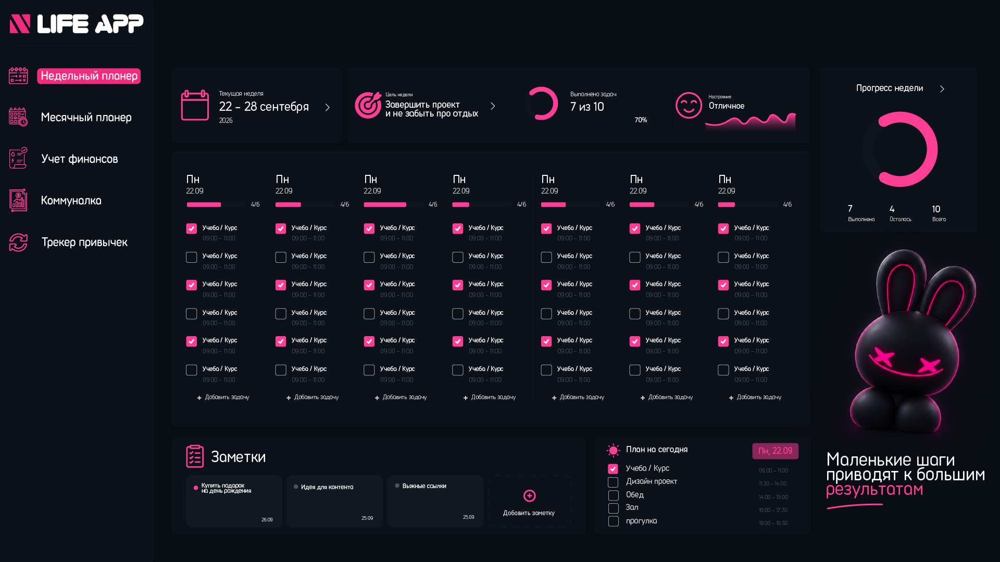
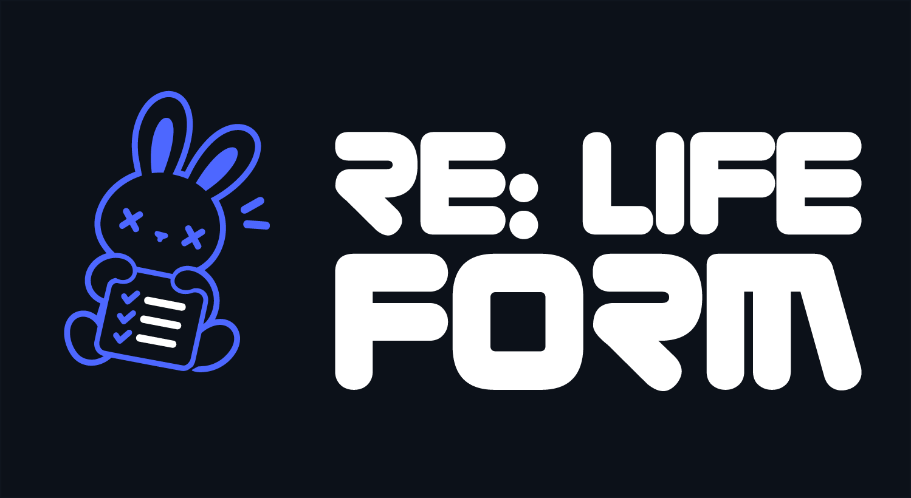
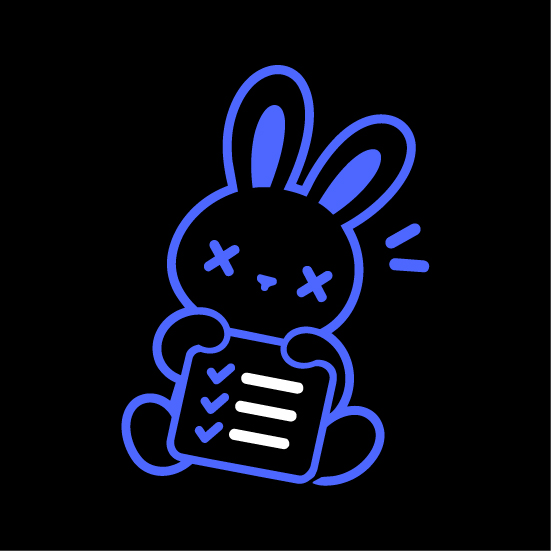
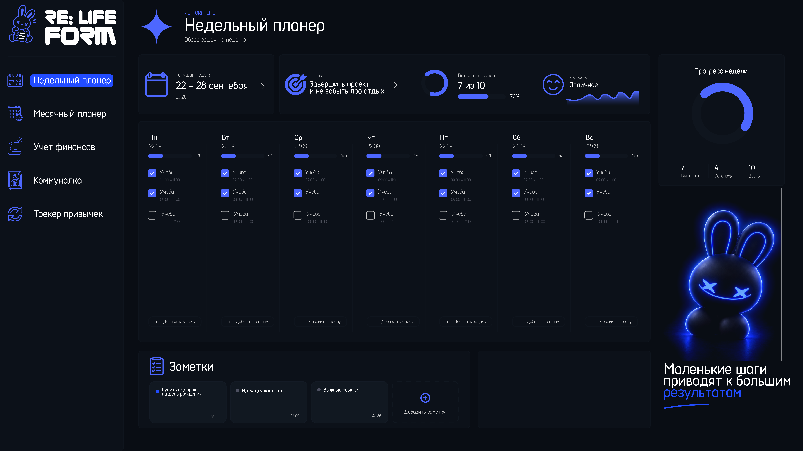
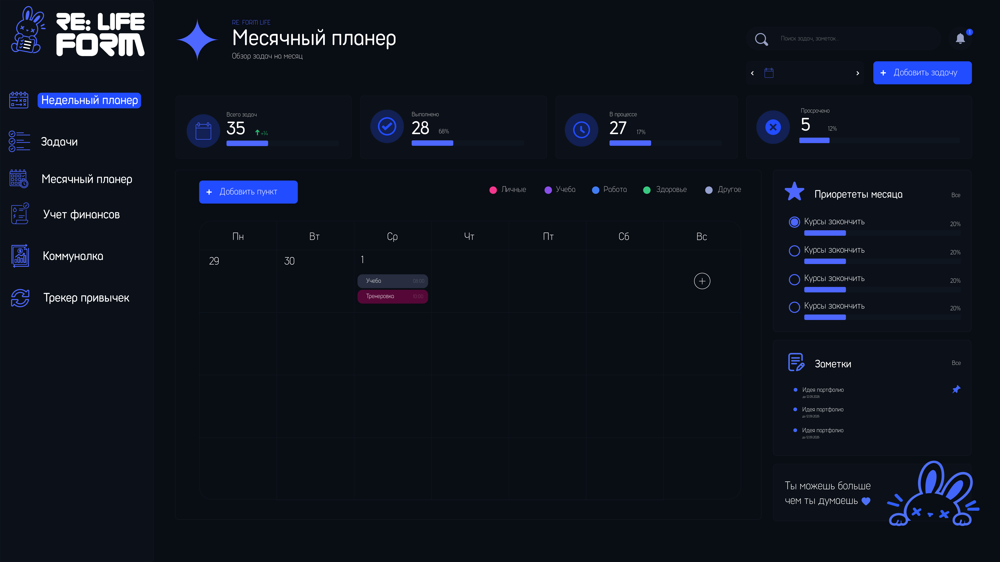

# RE:FORM LIFE

**Маленькие шаги приводят к большим результатам.**

Личное пространство для планов, задач, привычек, финансов и бытовых дел — с русскоязычным интерфейсом и ассистентом **EVE / Эва**. Идея проекта: собрать повседневные заботы в одном приложении, чтобы легче видеть главное и двигаться в своём темпе.

**Статус: ранний прототип, активная разработка.** Репозиторий пока закрыт. Код и визуальное направление развиваются; совместимость, доступность и готовность к распространению ещё требуют проверки. Изображения в этом README — авторские дизайн-референсы, а не подтверждённые скриншоты текущей сборки. Первая картинка сохранена из первого вложения пользователя.

[Описание приложения](docs/PRODUCT.md) · [Отчёт по коду](docs/CODE_REVIEW.md) · [Отчёт по дизайну](docs/DESIGN_REVIEW.md) · [План развития](docs/ROADMAP.md) · [Запуск и проверка](docs/SETUP.md)

## Зачем это приложение

Утром — понять, что важно сегодня. В течение дня — быстро добавить задачу или расход. Вечером — отметить привычки, настроение и небольшой результат. На выходных — посмотреть неделю и спокойно выбрать следующий шаг.

RE:FORM LIFE объединяет планирование и бытовой учёт. EVE добавляет голосовой способ взаимодействия: знакомые команды разбираются кодом, а Gemini при настроенном ключе поддерживает свободный разговор и работу с инструментами приложения. EVE может прочитать актуальные данные и предложить пакет изменений задач для подтверждения. [Устройство harness и его пределы](docs/HARNESS.md).

## Что уже есть в коде

| Раздел | Возможности |
| --- | --- |
| Недельный планер | Задачи по дням и времени, выполнение, цель недели, заметки, настроение |
| Задачи | Отдельная область задач, пользовательские разделы и категории |
| Месячный планер | Календарь, категории, приоритеты с прогрессом, поиск и список просроченных задач |
| Финансы | Доходы и расходы, категории накоплений, операции и планы накоплений |
| Коммуналка | Несколько лицевых счетов, услуги, показания счётчиков, расчёт платежей, даты оплаты и отметки передачи показаний |
| Привычки | Привычки и ежедневные отметки |
| EVE | Текстовые и голосовые команды, история, персональная память, Gemini с инструментами чтения данных и подтверждаемыми изменениями задач, варианты распознавания и озвучивания |

Наличие реализации не означает, что все сценарии полностью проверены. Подробнее о пределах проверки — в [отчёте по коду](docs/CODE_REVIEW.md).

## Визуальное направление

Тёмные поверхности, яркий синий акцент, календарные сетки и персонаж-кролик создают узнаваемый образ. Розовая обложка показывает раннюю концепцию LIFE APP; синие макеты — развитие айдентики RE:FORM LIFE. Текущий код также использует брендинг EVE, поэтому единое оформление продукта ещё предстоит закрепить.

### Логотип RE:FORM LIFE



### Персонаж и варианты фирменной графики

| Кролик с чек-листом | Линейный вариант |
| --- | --- |
|  |  |

### Недельный планер — дополнительная розовая версия

Первая розовая версия расположена в самом начале README. Здесь — второй присланный вариант.


### Недельный планер — синяя концепция



### Месячный планер



### Месячный планер — вариант JPG


### Месячный планер — дополнительный вариант PNG


Все **9 присланных изображений** показаны в этом README: первая картинка в начале, логотип, два варианта персонажа и остальные макеты выше. [Исходные имена файлов](docs/assets/README.md) · [Разбор дизайна](docs/DESIGN_REVIEW.md).

## Как устроен проект

Приложение написано на **Python и Flask**, хранит данные в **SQLite**, использует **Jinja, обычный JavaScript и CSS**. **pywebview** открывает локальный интерфейс в отдельном окне, **PyInstaller** используется для сборок. В репозитории также есть сценарий сборки Windows и macOS; качество готовых сборок в рамках оформления документации не проверялось.

```text
RE-FORM-LIFE/
├── app.py                   # страницы, API, данные и бизнес-логика
├── launcher.py              # локальный сервер и окно приложения
├── eve_assistant.py         # разбор команд
├── eve_agent.py             # микрофон и действия на компьютере
├── eve_local.py             # Gemini и локальная озвучка
├── eve_speechkit.py         # интеграция Yandex SpeechKit
├── templates/              # страницы и общие диалоги
├── static/                 # JavaScript, стили, шрифты и графика
├── tests/                  # существующие автоматические проверки
├── build-profiles/         # профили сборки голоса
└── docs/                   # описание, отчёты, развитие и референсы
```

## Быстрый запуск на Windows

Рекомендуемая исходная версия Python — **3.13**, как в сценарии сборки. Команды выполняются из папки проекта в PowerShell:

```powershell
python -m venv .venv
.\.venv\Scripts\python.exe -m pip install -r requirements.txt
.\.venv\Scripts\python.exe launcher.py
```

Базовый планер не требует ключей облачных сервисов. Для разговора Gemini нужен `GEMINI_API_KEY`; для отдельных вариантов речи — дополнительные зависимости и модели. Подробности: [инструкция запуска](docs/SETUP.md) и [настройка EVE](EVE_LOCAL_SETUP.md).

## Данные и приватность

Основные данные сохраняются в локальной базе. При запуске исходников это `instance/reform_life.sqlite3`; каталог исключён из Git. В упакованной версии путь определяется через `LOCALAPPDATA` / `APPDATA`. Его можно переопределить переменными `REFORM_LIFE_DATA_DIR` или `REFORM_LIFE_DB`.

При включённом разговоре Gemini получает текст и контекст беседы. В режиме SpeechKit аудио и текст озвучки отправляются в Yandex Cloud. Браузерное распознавание может использовать внешний сервис. Поэтому для каждого режима важно понимать, какие данные покидают компьютер; наличие локальной базы не делает все функции офлайн.

## Куда развивается идея

Предложения: короткий обзор дня, спокойный недельный итог, резервные копии, понятные режимы приватности EVE и более удобный интерфейс для небольших экранов. Это идеи для следующих этапов, а не обещания уже готовых функций. [Приоритеты и критерии готовности →](docs/ROADMAP.md)

## Права и распространение

Общая лицензия на исходный проект пока не объявлена. Перед открытием репозитория нужно выбрать её и проверить права на графику, шрифты и модели. Голосовые профили имеют разные условия: personal / Silero содержит ограничения на коммерческое использование; commercial / Qwen использует Apache-2.0 для соответствующей модели. Название профиля не определяет лицензию всего приложения.

См. [уведомления о сторонних компонентах](THIRD_PARTY_NOTICES.md), [настройку EVE](EVE_LOCAL_SETUP.md) и [подготовку к публичному репозиторию](docs/ROADMAP.md#перед-переходом-в-публичный-репозиторий).
